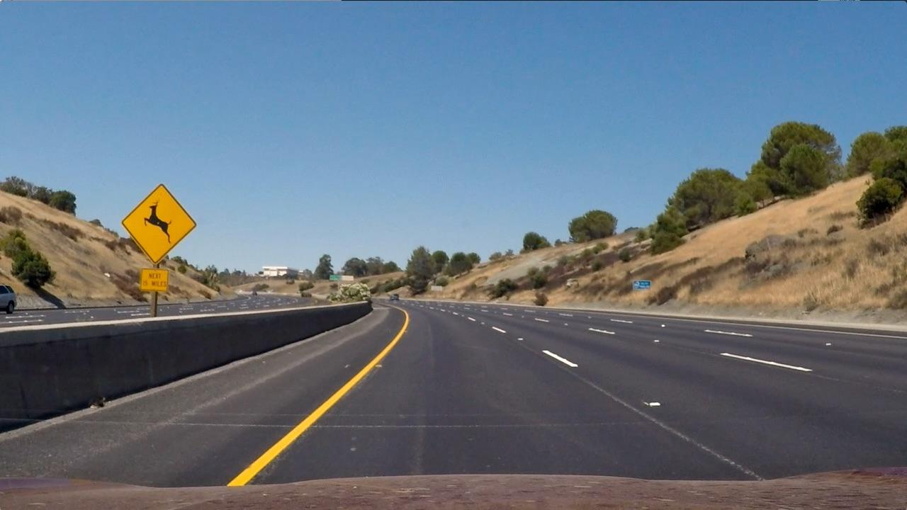
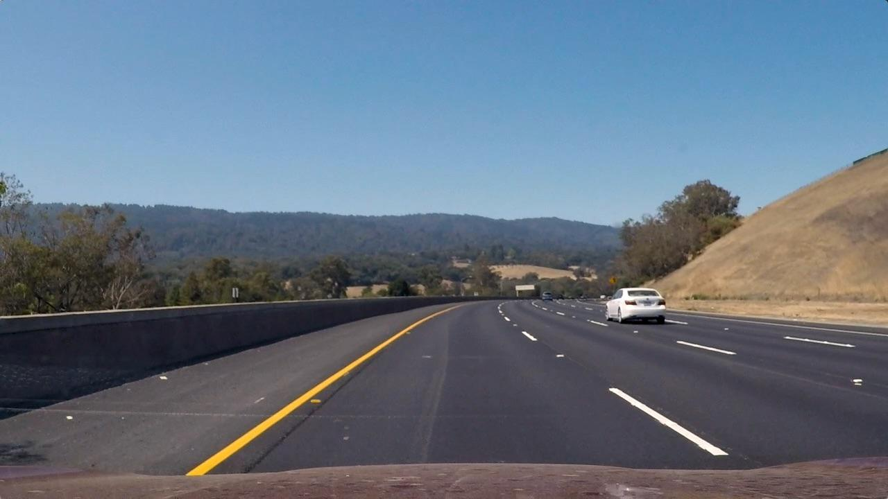
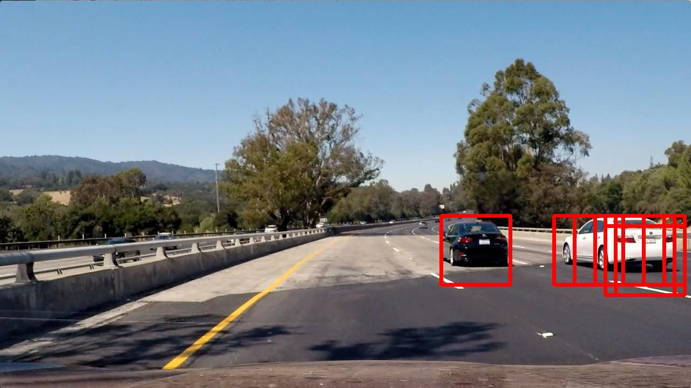
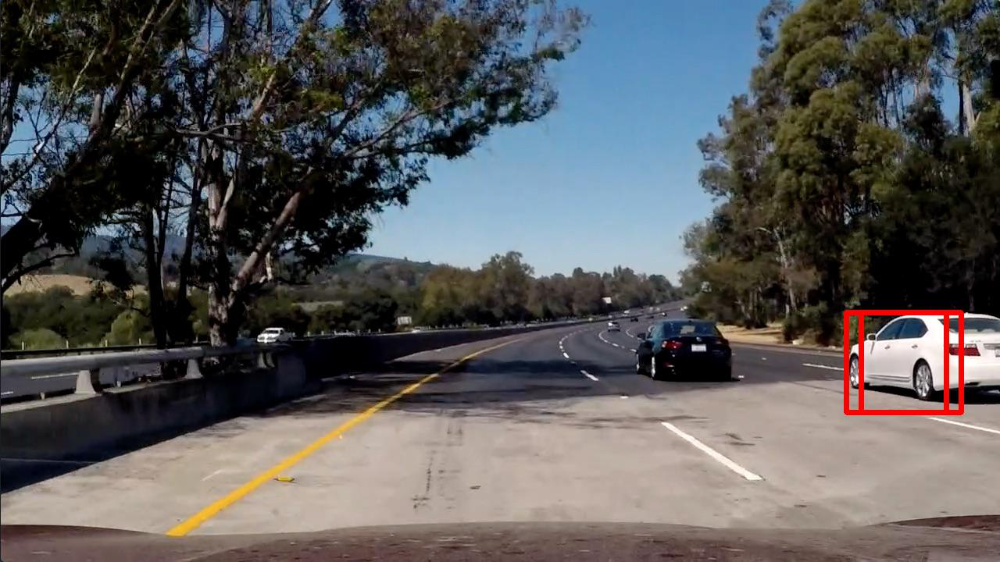
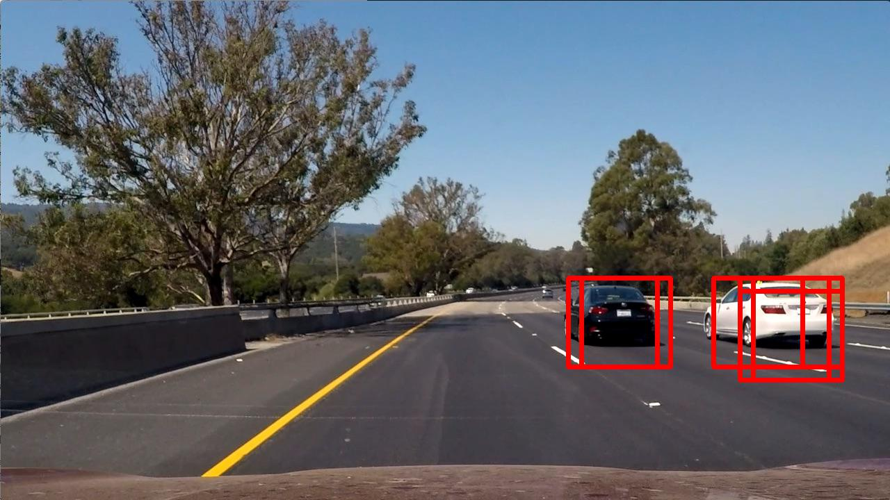
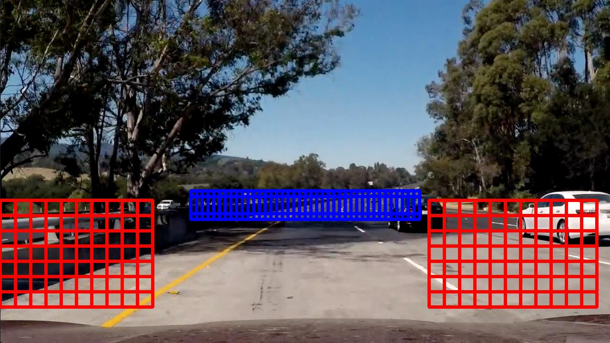
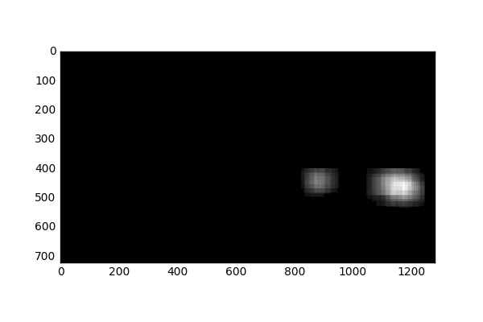

**Vehicle Detection Project**

The goals / steps of this project are the following:

* Perform a Histogram of Oriented Gradients (HOG) feature extraction on a labeled training set of images and train a classifier Linear SVM classifier
* Optionally, you can also apply a color transform and append binned color features, as well as histograms of color, to your HOG feature vector. 
* Note: for those first two steps don't forget to normalize your features and randomize a selection for training and testing.
* Implement a sliding-window technique and use your trained classifier to search for vehicles in images.
* Run your pipeline on a video stream (start with the test_video.mp4 and later implement on full project_video.mp4) and create a heat map of recurring detections frame by frame to reject outliers and follow detected vehicles.
* Estimate a bounding box for vehicles detected.

The Repo contains:

`src/classifier.py` - implementation of classifer

`src/feature_extract.py` - implementation of feature extraction

`src/helper_funcs.py` - helper functions

`src/load_data.py` -loading data

`src/params.py` - parameters

`src/slide_window.py` -sliding window operations

`main.py` - pipeline on images and video

`project_video.mp4` -raw video

`output_test_images/` -output images directory

`vehicles/` - training vehicle images directory

`non-vehicles/`- training non vehicle images directory

### Histogram of Oriented Gradients (HOG)

#### 1. Explain how (and identify where in your code) you extracted HOG features from the training images.

The code for this step is contained in `src/feature_extract.py`

I started by reading in all the `vehicle` and `non-vehicle` images using `src/load_data.py`.  Here is an example of one of each of the `vehicle` and `non-vehicle` classes:


and its HOG:


The project required to build a classifier that is able to answer if there is a car in a given image (subset of the whole image). To address this task three types of features were used: HOG (Histogram of Oriented Gradients) (shape features), binned color (color and shape features) and color histogram features (color only features). This combination of features can provide enough information for image classification.

Firstly, an automated approach was applied to tune the HOG parameters (`orientations, pixels_per_cell, cells_per_block`).

Something like:
```Python
from skopt import gp_minimize
space  = [(8, 64),                  # nbins
          (6, 12),                  # orient
          (4, 16),                   # pix_per_cell
          (1, 2)]                   # cell_per_block
i = 0
def obj(params):
    global i
    nbins, orient, pix_per_cell, cell_per_block = params
    car_features = extract_features(cars[0:len(cars):10], nbins, orient, pix_per_cell, cell_per_block)
    notcar_features = extract_features(notcars[0:len(notcars):10], nbins, orient, pix_per_cell, cell_per_block)
    y = np.hstack((np.ones(len(cars[0:len(cars):10])), np.zeros(len(notcars[0:len(notcars):10]))))
    X = np.vstack((car_features, notcar_features)).astype(np.float64)                        
    # Fit a per-column scaler
    X_scaler = StandardScaler().fit(X)
    # Apply the scaler to X
    scaled_X = X_scaler.transform(X)
    X_train, X_test, y_train, y_test = train_test_split(scaled_X, y, test_size=0.2, random_state=22)
    svc = LinearSVC()
    svc.fit(X_train, y_train)
    test_acc = svc.score(X_test, y_test)
    print i, params, test_acc
    i+=1
    return 1.0-test_acc
    
res = gp_minimize(obj, space, n_calls=20, random_state=22)
"Best score=%.4f" % res.fun
```

#### 2. Explain how you settled on your final choice of HOG parameters.

However, results were not very good because it ended with high numbers for HOG parameters which results in very slow feature extraction with comparable to less computational-expensive parameters set accuracy. That is why, the parameters for HOG as well as parameters for other features extractors were finetuned manually by try and error process so that it optimizes accuracy and computation time.

Final parameter for feature extraction:

```Python
color_space = 'LUV' # Can be RGB, HSV, LUV, HLS, YUV, YCrCb
orient = 8  # HOG orientations
pix_per_cell = 8 # HOG pixels per cell
cell_per_block = 2 # HOG cells per block
hog_channel = 0 # Can be 0, 1, 2, or "ALL"
spatial_size = (16, 16) # Spatial binning dimensions
hist_bins = 32    # Number of histogram bins
```
#### 3. Describe how (and identify where in your code) you trained a classifier using your selected HOG features (and color features if you used them).

The code for this step is contained in `src/classifier.py`

Normalizing ensures that a classifier's behavior isn't dominated by just a subset of the features, and that the training process is as efficient as possible. That is why, feature list was normolized by the `StandardScaler()` method from `sklearn`. The data is splitted into thaining and testing subsets (80% and 20%). The classifier is a linear SVM. It was found that it performs well enough and quite fast for the task.

### Sliding Window Search

#### 1. Describe how (and identify where in your code) you implemented a sliding window search.  How did you decide what scales to search and how much to overlap windows?

Basic sliding window algoritm was implemented in the same way to one presented in Udacity's lectures (See the code chunks under *Slide window* header). It allows to search a car in a desired region of the frame with a desired window size (each subsamled window is rescaled to 64x64 px before classifing by the SVC).

The window size and overlap should be wisely selected. Size of the window should be compared to the size of an expected car. These parameters were set to mimic perspective.

There are some sample results for a fixed window size (128x128 px) and overlap for the provided test images:








As we can see on examples above, the classifier successfully finds cars on the test images. However, there is a false positive example, so, we will need to apply a kind of filter (such as heat map) and the classifier failed to find a car on th 3rd image because it is too small for it. That is why, we will need to use multi scale windows.

---

### Video Implementation

#### 1. Provide a link to your final video output.  Your pipeline should perform reasonably well on the entire project video (somewhat wobbly or unstable bounding boxes are ok as long as you are identifying the vehicles most of the time with minimal false positives.)

Here's a [link to my video result](https://www.youtube.com/watch?v=-s-7U2d2WCg)
<a href="http://www.youtube.com/watch?feature=player_embedded&v=-s-7U2d2WCg
" target="_blank"></a>


#### 2. Describe how (and identify where in your code) you implemented some kind of filter for false positives and some method for combining overlapping bounding boxes.

Implemented Ideas:

- To increase the classifier accuracy, feature extraction parameters were tuned. The data was augmented by flipped images.

- To reduce number of false positives a heatmap with a threshold approach was implemented in the same to the suggested in the lectures way. For video the heatmap is accumulated by two frames which reduces number of outliers false positives.

- To increase performance it is needed to analize the smallest possible number of windows. That is why, one can scan with a search window not across the whole image, but only areas where a new car can appear and also we are going to scan areas where a car was detected (track cars) 

*There is an example of a new car detection ROI:*




- It is important to use different scale of the classifiers window on different parts of the image due to perspective. So, different ROI  window sizes were applied on different areas (realized in the `frame_proc` function in `src/helper_funcs.py`).

- In order to reduce jitter the function `filt` applies a simple low-pass filter on the new and the previous cars boxes coordinates and sizes (see under the *Frames processing* header) with weight `ALPHA=0.75` of the previous data. This makes car boundaries on video quite smooth.

- To increase performance the analizys was skiped for every 2nd frame because we do not expect very fast moving of the detected cars. Known cars boundaries from the previous frame is used in such cases.

Areas of interest for tracking of detected cars are marked green. Hot windows (which were classified as cars) are yellow.


The heatmap of found hot windows overlap:



---

### Discussion

#### 1. Briefly discuss any problems / issues you faced in your implementation of this project.  Where will your pipeline likely fail?  What could you do to make it more robust?

- Of course, the algorithm may fail in case of difficult light conditions, which could be partly resolved by the classifier improvement.

- It is possible to improve the classifier by additional data augmentation, hard negative mining, classifier parameters tuning etc.

- The algorithm may have some problems in case of car overlaps another. To resolve this problem one may introduce long term memory of car position and a kind of predictive algorithm which can predict where occluded car can be and where it is worth to look for it.
